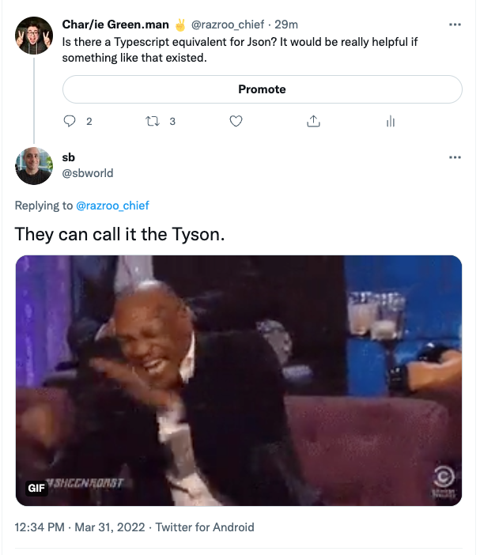

# tyson
Typescript equivalent for JSON



## Here's what I have in mind

```
interface TsonTest {
  title: string;
  position: number;
  type: string;
}
// test.tson
{: TsonTest
  title: "sample title",
  position: 0,
  type: "sample type",
} 
```

compiles to 
```
/// test.json 
{
  "title": "sample title",
  "position": 0,
  "type": "sample type",
} 
```
